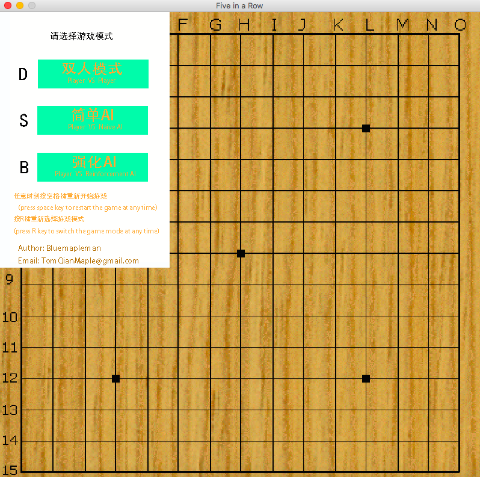
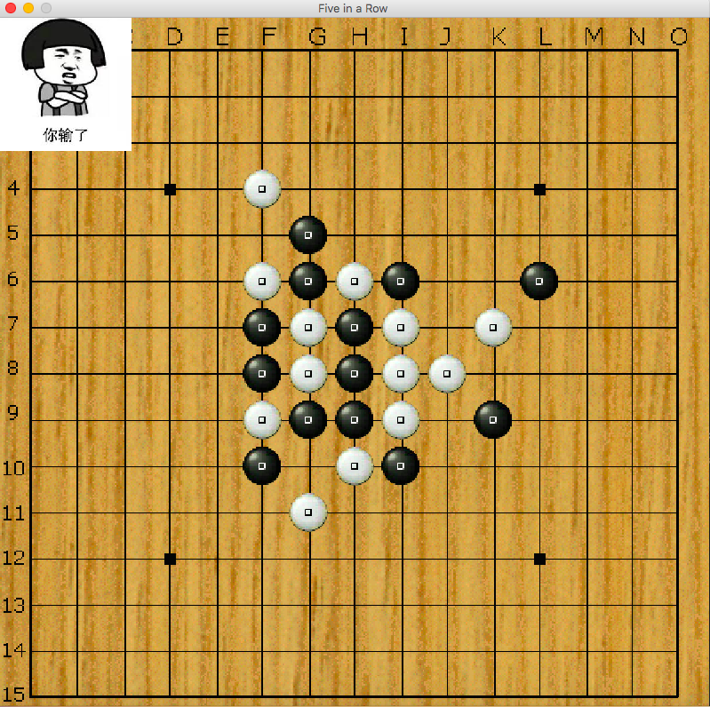

# RLFiveInARow

Five in a Row, a traditional strategy game implemented in Python. There are two types of AI player, one is simple AI which is hardcoded to act, and another AI is based on reinforcement learning, which is trained in the way AlphaGo Zero is trained. Also, the game can be played by two human players at the same time.

You can press Space key at any time to restart the game, and press R key to choose game mode.

(The reinforcement AI is still under developing)

Try to beat my simple AI first!!HAHA!

Have Fun!